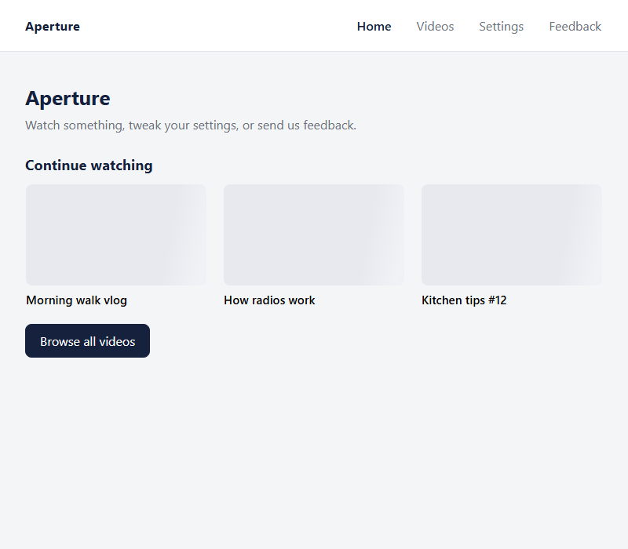
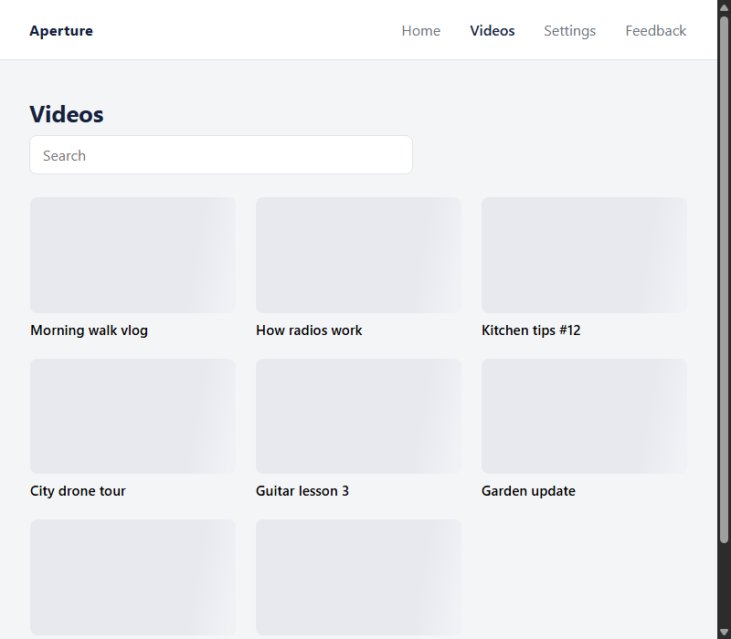
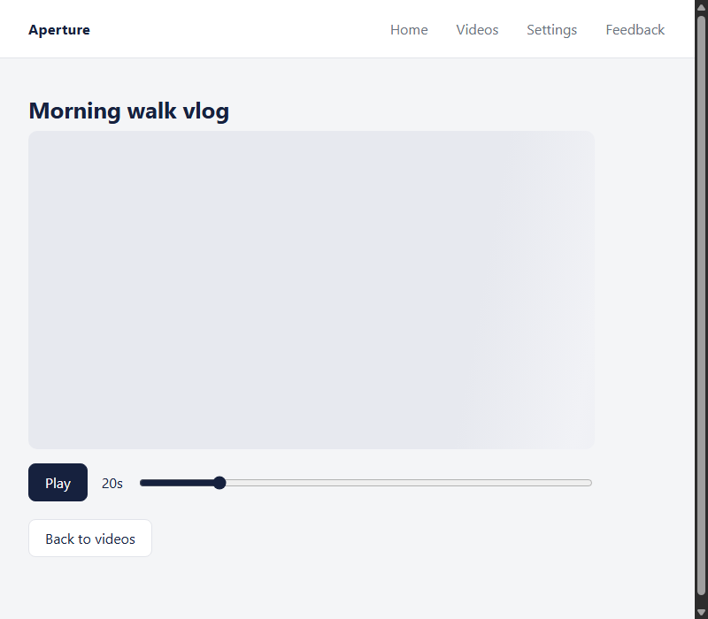
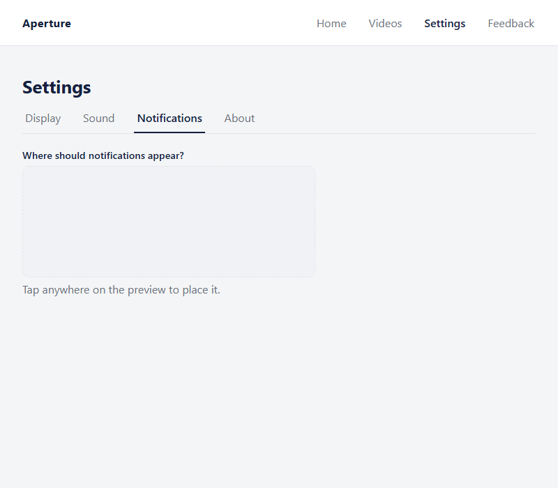
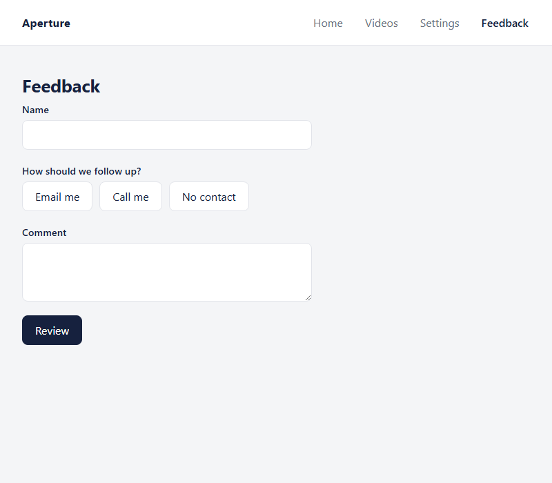

# Adaptive Capability-Profile Access Layer

Startathon submission — accessibility as a continuous capability profile, not a set of disability labels. See [docs/idea/](docs/idea/README.md) for the full concept, and [docs/tech/](docs/tech/README.md) for implementation notes.

## Repo layout

- [`docs/idea/`](docs/idea/README.md) — the product idea: problem, model, calibration design, scope, risks, event submission answers.
- [`docs/tech/`](docs/tech/README.md) — implementation notes: what's decided vs. still open on the tech stack.
- [`code/app/`](code/app/) — the Flutter phone/remote-control app.
- [`code/mock/`](code/mock/) — **Aperture**, a plain HTML/CSS/JS mock website (video browsing, settings, a feedback form). This is the *target application* the real adaptive system will eventually operate on — see below.

## Aperture (`code/mock/`)

A normal, everyday website — not the accessibility layer itself. It deliberately has no profile-switching UI of its own; that logic belongs on the phone/remote-control side ([docs/idea/07-architecture.md](docs/idea/07-architecture.md)). Aperture exists to give the agent a realistic, self-built surface to operate on, covering the everyday UI patterns a person actually runs into: card-grid selection, a video player with discrete + continuous controls, tabs, a free-tap preview, and a short form ending in review/confirm.

| Home | Videos |
|---|---|
|  |  |

| Player | Settings — Notifications |
|---|---|
|  |  |

| Feedback form |
|---|
|  |

Run it locally:

```bash
npx serve code/mock
```
