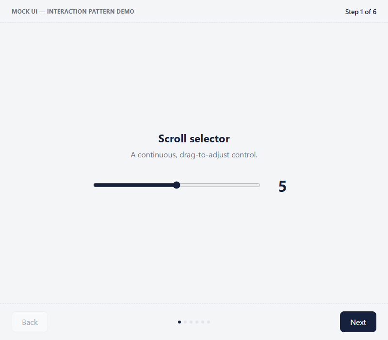
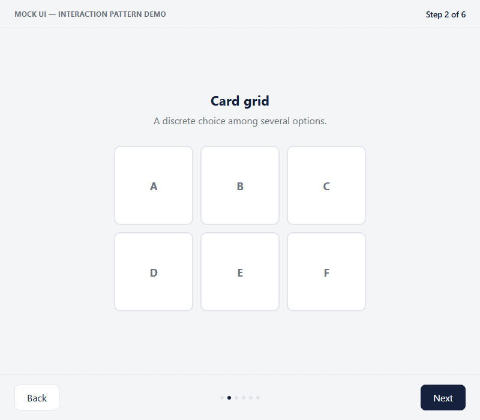
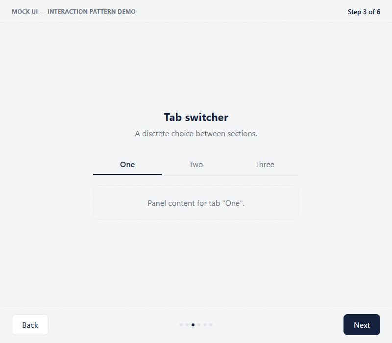
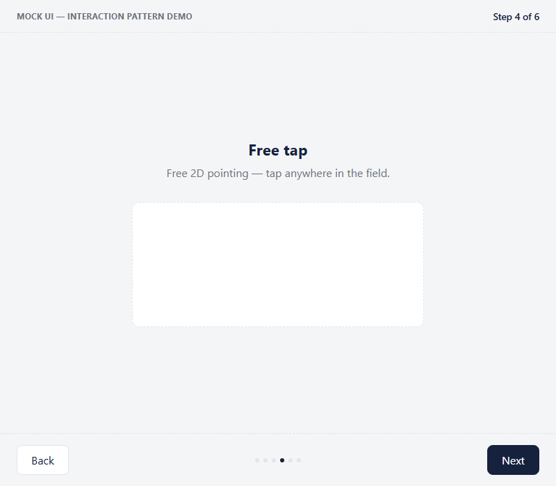
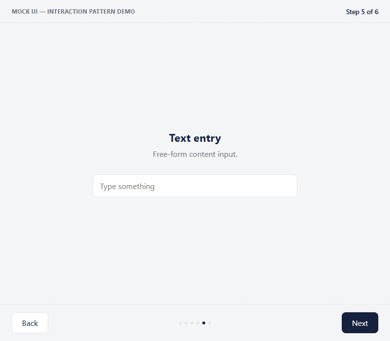
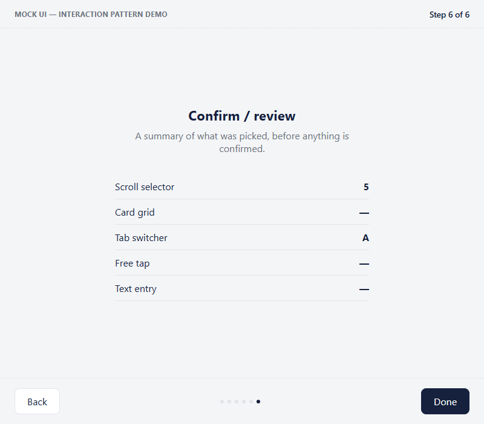

# Adaptive Capability-Profile Access Layer

Startathon submission — accessibility as a continuous capability profile, not a set of disability labels. See [docs/idea/](docs/idea/README.md) for the full concept, and [docs/tech/](docs/tech/README.md) for implementation notes.

## Repo layout

- [`docs/idea/`](docs/idea/README.md) — the product idea: problem, model, calibration design, scope, risks, event submission answers.
- [`docs/tech/`](docs/tech/README.md) — implementation notes: what's decided vs. still open on the tech stack.
- [`code/app/`](code/app/) — the Flutter phone/remote-control app.
- [`code/mock/`](code/mock/) — a mock UI: a sequence of isolated, honestly-labeled interaction patterns. This is the *target application* the real adaptive system will eventually operate on — see below.

## Mock UI (`code/mock/`)

Deliberately **not** dressed up as a real app — it doesn't hide that it's a mock. It steps through one UI pattern at a time (Back/Next, "Step X of N"), each pattern shown in isolation rather than buried in a fake product narrative. This also keeps it honest about what it is: the *target application* the real adaptive system will operate on later, not the accessibility layer itself — that profile-switching logic belongs on the phone/remote-control side ([docs/idea/07-architecture.md](docs/idea/07-architecture.md)).

Six patterns, matching the task shapes in [docs/idea/03-input-calibration.md](docs/idea/03-input-calibration.md): a continuous scroll selector, a discrete card grid, a discrete tab switcher, free 2D pointing, free-text entry, and a confirm/review summary.

| 1 — Scroll selector | 2 — Card grid |
|---|---|
|  |  |

| 3 — Tab switcher | 4 — Free tap |
|---|---|
|  |  |

| 5 — Text entry | 6 — Confirm / review |
|---|---|
|  |  |

Run it locally:

```bash
npx serve code/mock
```

Jump straight to a step with `?step=N` (0-indexed) — e.g. `http://localhost:3000/?step=2` opens the tab switcher directly.
