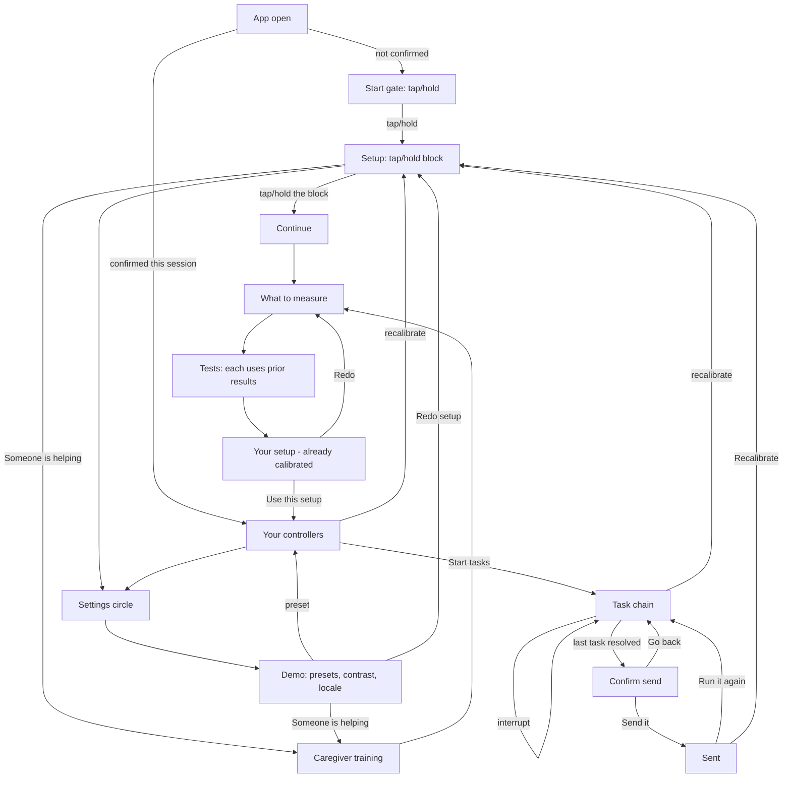

# Phone app UI/UX wireframe spec

**Also see** [idea/30 — Meeting Notes: Onboarding & Calibration Walkthrough](../idea/30-meeting-notes-onboarding-calibration-walkthrough.md) for the decisions that drove Start gate, Hold reorder, and axis hold-to-skip.

Low-fi wireframe in text: every screen, what is essential vs supporting, and the only legal order. Documents what is already built in `code/app` plus the intended flow. Not a pixel mock. Not a visual redesign.

**Code:** `code/app/lib/main.dart` (screens), `calibration/`, `runtime/`, `training/`, `vision/`.  
**Requirements:** [idea/08-requirements.md](../idea/08-requirements.md).  
**Scope:** [idea/05-scope.md](../idea/05-scope.md).  
**Voice/text modes:** [desgin.md](desgin.md).

---

## 1. Purpose

| Who | What they do |
|---|---|
| **Person being measured** | Tap/hold to start, run (or skip) tests, use the resulting controllers on a short task chain |
| **Optional helper** | Same phone; practice motions first, then pick which axes to measure |
| **Judge / demo** | Skip live calibration via Profile A / B / Floor presets; same runtime object |

**Done** means: a `CapabilityProfile` exists, then at least one consequential intent is confirmed and “sent” (logged to the output strip — no real laptop wire in this build).

---

## 2. Global rules

These apply once measurement has started (live draft) and after a confirmed profile (preview + demo).

| Rule | Detail |
|---|---|
| **Output strip** | Laptop preview: last intent + live raw signal. Sits on the row the user cannot reach (`outputAtBottom`). Tap opens the event log. |
| **Visual field shell** | Tunnel or peripheral veil; mask uses `IgnorePointer`. Stays **full** until vision commits; then applies including on the results report. |
| **Theme** | Haiku after axes/profile; **high contrast** is a peer palette (WCAG 4.5:1 text / 3:1 chrome), not a haiku variant. |
| **Scale / targets** | Text scale from vision; min target size from buttons — applied to Skip and later chrome **as soon as measured**. |
| **Input dock** | Joystick floats at stick home / reach anchor; everything else docks inside the reachable zone. |
| **Live draft** | After each test, `draft.build()` is pushed into `AppState` so the next step is already shaped. |
| **Recalibrate / Redo** | Settings, results, or preview tune → **Setup** (clears confirmation). Never back to a blended demo home. |

**Calibration step chrome** (shared `StepFrame`):

- One short instruction line, always in the same place.
- Progress `N of M`.
- **Skip this test** always present; height follows measured `minTargetSize`.
- **Back** from the second test on, same size, opposite Skip (left). Retakes the previous test as untested. Hidden on the first test — does not return to the axis picker.
- Skip = **untested**, never failed.

---

## 3. Locked end-to-end flow

Do not reorder these edges.



### Flow notes

- **Start gate is first** — full-bleed tap/hold, nothing else. Then Setup.
- **Setup** — helper / contrast / locale sit up top, out of the thumb zone. The reachable lower region is only the tap/hold-to-start block. Welcome clip autoplays. Demo presets live behind the **settings circle** (top-right).
- **Continue** (after Setup tap) is a slim reach-zone screen. It does not replay welcome or re-ask the helper question.
- **Presets skip measurement on purpose** (judge demo, scope item 3). Live calibration and a preset both produce the same `CapabilityProfile`.
- **Assisted:** training → axes (not training → entry). Helper button stays on Setup at the same time as the start block.
- **After each motor/voice/vision step**, the partial profile is live-applied before the next step.
- **Back** during tests returns one step and starts that test over as untested. Hidden on the first test; it does not return to the axis picker.
- **Results already use** measured size, scale, and field. “Use this setup” confirms for the session; it does not start applying the profile.
- In-session only: killing the app returns to the Start gate / Setup path.

---

## 4. Screen inventory

Each screen: ASCII wireframe → essential → supporting → functions.

### 4.0a Start gate

First screen. One job: a tap or hold continues to Setup. No header, no audio, no toggles.

```
┌─────────────────────────────────────┐
│                                     │
│            (touch icon)             │  ← full-bleed tap/hold
│                                     │
└─────────────────────────────────────┘
```

| Essential | Supporting |
|---|---|
| Full-bleed tap/hold → Setup | |

### 4.1 Setup

```
┌─────────────────────────────────────┐
│ [helping] [contrast] [locale] (gear)│  ← upper, out of thumb zone
│ Set up how you control things       │
│ Recorded welcome (autoplay)         │
├─────────────────────────────────────┤
│ ┌ TAP / HOLD TO START ┐             │  ← only thing in reach zone
└─────────────────────────────────────┘
```

| Essential | Supporting |
|---|---|
| Lower block tap/hold → Continue | Recorded welcome, autoplay, Play recording to replay |
| Helper / contrast / locale in the upper region | Settings circle → demo sheet |

**Functions:** start solo measurement (via Continue); start assisted training; open settings for presets/contrast/locale.

### 4.1b Settings sheet (demo / judge)

| Essential | Supporting |
|---|---|
| High contrast + locale chips | |
| OR START FROM A SAVED PROFILE (A / B / Floor) | |
| Redo setup (when a profile is confirmed) | |
| Someone is helping set this up | |

Presets jump straight to preview. Redo clears confirmation and remounts Setup.

### 4.1c Continue (after Setup tap)

Slim post-tap screen. Does not replay welcome or re-ask the helper question. Assisted sessions skip this and open training.

```
┌─────────────────────────────────────┐
│ We'll measure what works.           │  ← out of thumb zone
├─────────────────────────────────────┤
│ ┌ CONTINUE ┐                        │  ← reach zone, tap/hold
└─────────────────────────────────────┘
```

| Essential | Supporting |
|---|---|
| Large Continue tap/hold → axis picker | Settings circle if shown |

### 4.2 Caregiver training

Reached only via “Someone is helping…”. No scores. Practice before measurement.

```
┌─────────────────────────────────────┐
│ Practice with a helper              │
│ (no score copy)                     │
│ ┌─ Recorded training clip ────────┐ │
│ └─────────────────────────────────┘ │
│ Motion 1 of 3 · Together            │
│ Instruction: Tap the square.        │
│ Helper: Hand under theirs…          │
│ ┌─────────────────────────────────┐ │
│ │           ARENA / TAP           │ │
│ └─────────────────────────────────┘ │
│ [ Try again ]                       │
│ [ Skip this motion ]                │
├─────────────────────────────────────┤
│ [ Skip all practice, go to measure ]│  ← pinned footer
└─────────────────────────────────────┘
```

| Essential | Supporting |
|---|---|
| One motion at a time: tap → slide left → slide up | Recorded training narration |
| Phase label: together / start-together-finish-alone / from the words alone | Independent hit counter when in independent phase |
| Helper copy: hand-under-hand default | |
| Arena (only practice target) | |
| Try again, skip this motion | |
| **Skip all practice, go to measurement** — pinned, always visible | |

**Functions:** fade prompt full → partial → independent (3 independent successes graduate a drill); skip motion; skip all → axis picker (`helperChoseAxes = true`).

---

### 4.3 Axis picker — “What should we measure?”

```
┌─────────────────────────────────────┐
│ What should we measure?             │
│ (optional) Setting this up for…     │  ← only if helperChoseAxes
│ All three start ON. Hold a row to skip. │
│ WHICH ENVIRONMENTS                  │
│ ┌ Motor ………………… ☑ hold-to-skip ┐     │
│ ┌ Speech …………… ☑ hold-to-skip ┐     │
│ ┌ Vision …………… ☑ hold-to-skip ┐     │
│ [ Start ]                           │  ← always enabled
└─────────────────────────────────────┘
```

| Essential | Supporting |
|---|---|
| Motor / Speech / Vision as **large whole-row targets**. All three default **ON**. | Helper provenance banner |
| Turning an axis **off** is a hold-to-confirm on that row (fill ring, same duration as the hold test). A tap does not turn it off; a tap on an off row turns it back on. | Haiku theme begins reacting live as rows change |
| Start always enabled. Last remaining axis cannot be skipped. | |

**Functions:** set `measureMotor` / `measureSpeech` / `measureVision`. Axes left off contribute **no** steps (speech-only never mounts joystick).

---

### 4.5 Measurement steps

Only steps for axes left on. Order when all on: reach → buttons → joystick → trackpad → hold → voice → vision.

| Step | Person does | Essential UI |
|---|---|---|
| **Reach** | Tap cells that work | 3×4 grid, skip |
| **Buttons** | Hit large targets | Targets at measured size, skip |
| **Joystick** | Swing per reachable cell | Stick + home-cell result, skip |
| **Trackpad** | Drag; axis lock if needed | Pad, skip |
| **Hold** | Press and hold | Hold target, skip |
| **Voice** | Say 8 sentences | Current sentence, word kept, “That word was clear” / “Not this one”, hold-to-speak, next sentence |
| **Vision** | Read shrinking word, then field | Acuity choice → full / tunnel / peripheral |

| Essential on every step | Supporting |
|---|---|
| Instruction + progress + Skip + Back (from step 2) | Idle timeout may skip a stuck step; toast explains |
| Skip / Back = untested | Simulated speech clarity chips on Voice |

**Voice buckets** after sentences: ≥6 words landed → `full`; some → `partial` + vocabulary; sounds heard → `sounds`; else `none`.

---

### 4.6 Results — “Your setup”

Four sections (tabs / section nav), not one endless scroll.

```
┌─────────────────────────────────────┐
│ Your setup                          │
│ [Overview][Methods][Voice][Tasks]   │
│ …section body…                      │
├─────────────────────────────────────┤
│ [ Redo ]           [ Use this setup ]│
└─────────────────────────────────────┘
```

| Section | Essential content |
|---|---|
| **Overview** | Measured environments; helper provenance if any; haiku card |
| **Methods** | Per-method scores; reach count; stick home; target size; steadiness; hold; voice; vision + field; input level; personal words if any |
| **Voice & text** | Dictate / vocal-confirm / touch-pick plan; skipped list; swipe axis lock if set |
| **Tasks** | For each task shape: which method, ideal vs fallback reason |

| Footer essential | Supporting |
|---|---|
| **Redo** → axis picker | Haiku motif (identity, not a control) |
| **Use this setup** → preview | |

---

### 4.7 Preview — “Your controllers”

```
┌─────────────────────────────────────┐
│ ▓▓▓ OUTPUT STRIP (laptop preview) ▓▓▓│
│ Your controllers          [tune]    │
│ [Buttons][Joystick·yours][…][Voice] │
│ Hint for current surface            │
│ ┌──── try pad / dock ─────────────┐ │
│ └─────────────────────────────────┘ │
│ [Simpler] Level: … [Level up]       │
│ [ Start tasks ]                     │
└─────────────────────────────────────┘
```

| Essential | Supporting |
|---|---|
| Output strip pinned | Level label copy |
| Surface chips: Buttons, Joystick, Trackpad, Switch, Voice (strongest marked “yours”) | |
| Try pad using this profile’s size / reach / voice mode | |
| **Simpler / Level up** (one → two → many targets) | |
| **Start tasks** | |
| Recalibrate (tune) → home | |

---

### 4.8 Demo task chain

Fixed order. Every task screen shares:

```
┌─────────────────────────────────────┐
│ ▓▓▓ OUTPUT STRIP ▓▓▓                │  (top or bottom by reach)
│ Ribbon: prompt + why this method    │
│ [recalibrate] [controllers]         │
│ ┌──── task body / dock ───────────┐ │
│ └─────────────────────────────────┘ │
│ [ Stop / start this step over ]     │
└─────────────────────────────────────┘
```

| # | Task | Shape | Essential behavior |
|---|---|---|---|
| 1 | Pick a plan | Discrete | Options paged by `visibleOptionCount`; method from fallback rule |
| 2 | Set seat count | Continuous | Adjust + confirm with chosen method |
| 3 | Mark a spot | Pointing | Place marker; agent-assist only when not trackpad |
| 4 | Add a note | Text (fusion) | See Thesis B below |
| 5 | Review | Discrete | “About to send…” + **Send it** / **Go back** via **same** method |
| 6 | Sent | Done | Run it again / Recalibrate |

**Interrupt:** resets **current step** state only (not the whole profile / collected answers).

#### Text task — Thesis B (essential)

| Clarity | How content is filled |
|---|---|
| `full` / `partial` | Hold to speak → transcript → confirm (partial always confirms) |
| `sounds` | One sound / nod / hum = yes; two sounds = next phrase |
| `none` | Pick a suggested phrase by touch method |

**Vocabulary** (when `usesWordVocab`): small menus map words onto options; long menus map first three words to next / previous / select (e.g. `water` / `tank` / `yellow`).

---

## 5. How the same screen changes

| Lever | What changes |
|---|---|
| **Profile A** | Precise touch, clear speech → buttons-heavy, dictate, full field, many targets |
| **Profile B** | Imprecise touch + partial speech → often joystick fallback, vocab words, two targets |
| **Floor** | Switch scan, sounds tier, tunnel field, one target |
| **Input level** | How many discrete options visible at once (one / two / many capped by `maxControls`) |
| **Visual field** | Tunnel: condensed output window; peripheral: center veiled; both leave hits through |
| **High contrast** | Black / white / yellow peer theme |
| **Locale** | Recorded onboarding catalog `en` / `ml` |
| **Fallback rule** | Ideal method for the task shape unless another scores ≥ margin higher |

---

## 6. Supporting (never block the path)

- Event log sheet (from output strip).
- Play-recording button (timed transcript + screen-reader announcement until WAVs exist).
- Toast on skip / idle.
- Level-up / Simpler chrome on preview.
- Haiku motif on results.

---

## 7. Hard constraints (non-negotiable)

| Constraint | Why / FR |
|---|---|
| First action never harder than a single tap/hold anywhere | Issue #1; entry must not gate on precision |
| Helper path visible at the same time, not a second screen to discover | Research 11 |
| Every calibration step skippable | FR13–15 honesty; untested ≠ fail |
| No consequential send without explicit confirm | FR7 |
| Interrupt resets current step, not whole profile | FR8 |
| Skip / untested ≠ fail | Results / scoring honesty |
| Field mask never steals hits | Issue #4 |
| High contrast peer to haiku (4.5:1 / 3:1) | Research 11 |
| Profile switch visibly reshapes the interface | Scope item 3; FR11 |
| Touch + voice fused at least once on partial profile | Scope item 4; FR4 |

---

## 8. Out of scope for this phone wireframe

- Desktop ranking / inspector.
- Aperture Daily mock websites.
- Real microphone / WAV assets (catalog stands in).
- Agent filling a real form / laptop wire.
- Camera head-nod as a separate sensor.

Those are other surfaces or future work; this spec stays on the Flutter phone flow only.
