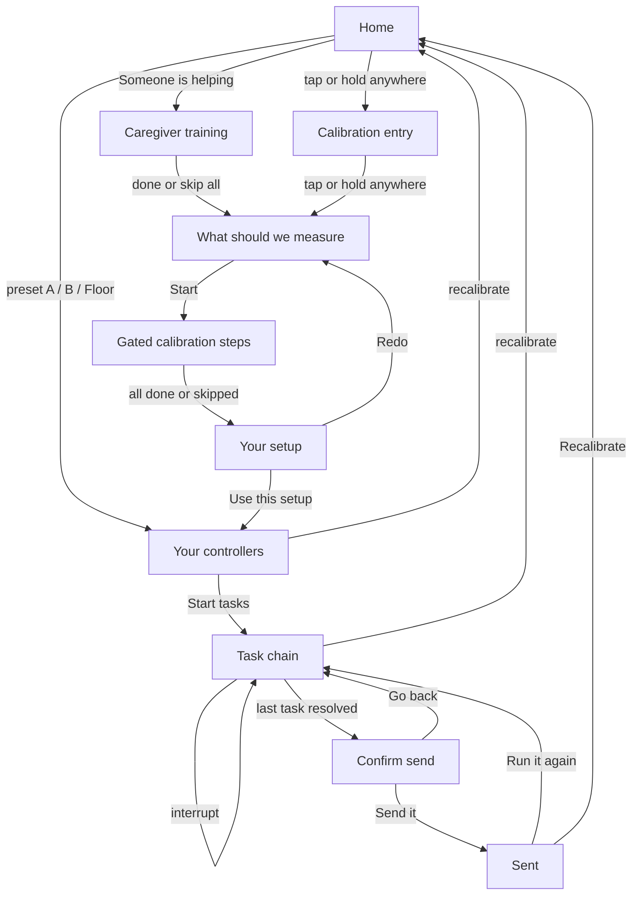

# Phone app UI/UX wireframe spec

Low-fi wireframe in text: every screen, what is essential vs supporting, and the only legal order. Documents what is already built in `code/app` plus the intended flow. Not a pixel mock. Not a visual redesign.

**Code:** `code/app/lib/main.dart` (screens), `calibration/`, `runtime/`, `training/`, `vision/`.  
**Requirements:** [idea/08-requirements.md](../idea/08-requirements.md).  
**Scope:** [idea/05-scope.md](../idea/05-scope.md).  
**Voice/text modes:** [desgin.md](desgin.md).

---

## 1. Purpose

| Who | What they do |
|---|---|
| **Person being measured** | Tap/hold to start, run (or skip) tests, use the resulting controllers on a short task chain |
| **Optional helper** | Same phone; practice motions first, then pick which axes to measure |
| **Judge / demo** | Skip live calibration via Profile A / B / Floor presets; same runtime object |

**Done** means: a `CapabilityProfile` exists, then at least one consequential intent is confirmed and “sent” (logged to the output strip — no real laptop wire in this build).

---

## 2. Global rules (after home)

These apply on every screen once a profile is active (preview + demo), and on calibration steps where noted.

| Rule | Detail |
|---|---|
| **Output strip** | Laptop preview: last intent + live raw signal. Sits on the row the user cannot reach (`outputAtBottom`). Tap opens the event log. |
| **Visual field shell** | Tunnel or peripheral veil; mask uses `IgnorePointer` so aiming is never restricted to the hole. **Off on home.** |
| **Theme** | Haiku after axes/profile; **high contrast** is a peer palette (WCAG 4.5:1 text / 3:1 chrome), not a haiku variant. |
| **Scale / targets** | Text scale from vision acuity; min target size from calibration. |
| **Input dock** | Joystick floats at stick home / reach anchor; everything else docks inside the reachable zone. |
| **Recalibrate** | Always available from preview and demo → back to home. |

**Calibration step chrome** (shared `StepFrame`):

- One short instruction line, always in the same place.
- Progress `N of M`.
- **Skip this test** always present, always the same size.
- Skip = **untested**, never failed.

---

## 3. Locked end-to-end flow

Do not reorder these edges.



### Flow notes

- **Presets skip measurement on purpose** (judge demo, scope item 3). Live calibration and a preset both produce the same `CapabilityProfile`; runtime cannot tell them apart.
- **Assisted home:** training → axes (not training → entry).
- **Solo home:** entry → axes.
- Do **not** put a helper-only gate in front of the tap-anywhere entry. Helper control is visible at the same time as the primary tap block.

---

## 4. Screen inventory

Each screen: ASCII wireframe → essential → supporting → functions.

### 4.1 Home

```
┌─────────────────────────────────────┐
│ Access layer                        │
│ Tap or hold this block to start…    │
│ ┌─ Recorded welcome ──────────────┐ │
│ │ [Play]  transcript…             │ │
│ └─────────────────────────────────┘ │
│ ┌─────────────────────────────────┐ │
│ │     TAP ANYWHERE TO START       │ │  ← full-block gesture
│ └─────────────────────────────────┘ │
│ [ Someone is helping set this up ]  │  ← outside gesture
│ [ High contrast ]  [ English/ml ]   │
│ OR START FROM A SAVED PROFILE       │
│ ┌ Profile A · buttons ──────────┐   │
│ ┌ Profile B · joystick ─────────┐   │
│ ┌ Floor · switch scan ──────────┐   │
└─────────────────────────────────────┘
```

| Essential | Supporting |
|---|---|
| Full-block tap/hold to start (no small primary button) | Play-recording control (catalog + announcement until real WAVs) |
| Recorded welcome (transcript + locale) | |
| **Someone is helping set this up** — outlined, same time as tap block | |
| High-contrast chip | |
| Locale chip (`en` / `ml`) | |
| Three preset cards: A, B, Floor (label, summary, best-method chip) | |

**Functions:** start solo calibration; start assisted (training); toggle contrast/locale; jump to preview with a preset profile.

---

### 4.2 Caregiver training

Reached only via “Someone is helping…”. No scores. Practice before measurement.

```
┌─────────────────────────────────────┐
│ Practice with a helper              │
│ (no score copy)                     │
│ ┌─ Recorded training clip ────────┐ │
│ └─────────────────────────────────┘ │
│ Motion 1 of 3 · Together            │
│ Instruction: Tap the square.        │
│ Helper: Hand under theirs…          │
│ ┌─────────────────────────────────┐ │
│ │           ARENA / TAP           │ │
│ └─────────────────────────────────┘ │
│ [ Try again ]                       │
│ [ Skip this motion ]                │
├─────────────────────────────────────┤
│ [ Skip all practice, go to measure ]│  ← pinned footer
└─────────────────────────────────────┘
```

| Essential | Supporting |
|---|---|
| One motion at a time: tap → slide left → slide up | Recorded training narration |
| Phase label: together / start-together-finish-alone / from the words alone | Independent hit counter when in independent phase |
| Helper copy: hand-under-hand default | |
| Arena (only practice target) | |
| Try again, skip this motion | |
| **Skip all practice, go to measurement** — pinned, always visible | |

**Functions:** fade prompt full → partial → independent (3 independent successes graduate a drill); skip motion; skip all → axis picker (`helperChoseAxes = true`).

---

### 4.3 Calibration entry

Solo path after home tap/hold. Same “anyone can enter” standard as home.

```
┌─────────────────────────────────────┐
│            (full-screen tap)        │
│  Set up how you control things      │
│  no pass/fail copy…                 │
│  ┌ TAP ANYWHERE TO START ┐          │
│  Recorded welcome…                  │
├─────────────────────────────────────┤
│ [ Someone is helping set this up ]  │  ← outside gesture layer
└─────────────────────────────────────┘
```

| Essential | Supporting |
|---|---|
| Tap/hold anywhere → axis picker (`helperChoseAxes = false`) | Recorded welcome |
| Caregiver button **outside** the gesture so it stays hittable → training | |

---

### 4.4 Axis picker — “What should we measure?”

```
┌─────────────────────────────────────┐
│ What should we measure?             │
│ (optional) Setting this up for…     │  ← only if helperChoseAxes
│ WHICH ENVIRONMENTS                  │
│ ┌ Motor ………………… ☑/○ ┐              │
│ ┌ Speech …………… ☑/○ ┐              │
│ ┌ Vision …………… ☑/○ ┐              │
│ [ Start ]  or disabled if none on   │
└─────────────────────────────────────┘
```

| Essential | Supporting |
|---|---|
| Motor / Speech / Vision as **large whole-row toggles** (not tiny checkboxes) | Helper provenance banner |
| At least one axis required; Start disabled otherwise | Haiku theme begins reacting live as toggles change |
| Start → gated step list | |

**Functions:** set `measureMotor` / `measureSpeech` / `measureVision`. Axes left off contribute **no** steps (speech-only never mounts joystick).

---

### 4.5 Measurement steps

Only steps for axes left on. Order when all on: reach → buttons → joystick → trackpad → hold → voice → vision.

| Step | Person does | Essential UI |
|---|---|---|
| **Reach** | Tap cells that work | 3×4 grid, skip |
| **Buttons** | Hit large targets | Targets at measured size, skip |
| **Joystick** | Swing per reachable cell | Stick + home-cell result, skip |
| **Trackpad** | Drag; axis lock if needed | Pad, skip |
| **Hold** | Press and hold | Hold target, skip |
| **Voice** | Say 8 sentences | Current sentence, word kept, “That word was clear” / “Not this one”, hold-to-speak, next sentence |
| **Vision** | Read shrinking word, then field | Acuity choice → full / tunnel / peripheral |

| Essential on every step | Supporting |
|---|---|
| Instruction + progress + Skip | Idle timeout may skip a stuck step; toast explains |
| Skip = untested | Simulated speech clarity chips on Voice |

**Voice buckets** after sentences: ≥6 words landed → `full`; some → `partial` + vocabulary; sounds heard → `sounds`; else `none`.

---

### 4.6 Results — “Your setup”

Four sections (tabs / section nav), not one endless scroll.

```
┌─────────────────────────────────────┐
│ Your setup                          │
│ [Overview][Methods][Voice][Tasks]   │
│ …section body…                      │
├─────────────────────────────────────┤
│ [ Redo ]           [ Use this setup ]│
└─────────────────────────────────────┘
```

| Section | Essential content |
|---|---|
| **Overview** | Measured environments; helper provenance if any; haiku card |
| **Methods** | Per-method scores; reach count; stick home; target size; steadiness; hold; voice; vision + field; input level; personal words if any |
| **Voice & text** | Dictate / vocal-confirm / touch-pick plan; skipped list; swipe axis lock if set |
| **Tasks** | For each task shape: which method, ideal vs fallback reason |

| Footer essential | Supporting |
|---|---|
| **Redo** → axis picker | Haiku motif (identity, not a control) |
| **Use this setup** → preview | |

---

### 4.7 Preview — “Your controllers”

```
┌─────────────────────────────────────┐
│ ▓▓▓ OUTPUT STRIP (laptop preview) ▓▓▓│
│ Your controllers          [tune]    │
│ [Buttons][Joystick·yours][…][Voice] │
│ Hint for current surface            │
│ ┌──── try pad / dock ─────────────┐ │
│ └─────────────────────────────────┘ │
│ [Simpler] Level: … [Level up]       │
│ [ Start tasks ]                     │
└─────────────────────────────────────┘
```

| Essential | Supporting |
|---|---|
| Output strip pinned | Level label copy |
| Surface chips: Buttons, Joystick, Trackpad, Switch, Voice (strongest marked “yours”) | |
| Try pad using this profile’s size / reach / voice mode | |
| **Simpler / Level up** (one → two → many targets) | |
| **Start tasks** | |
| Recalibrate (tune) → home | |

---

### 4.8 Demo task chain

Fixed order. Every task screen shares:

```
┌─────────────────────────────────────┐
│ ▓▓▓ OUTPUT STRIP ▓▓▓                │  (top or bottom by reach)
│ Ribbon: prompt + why this method    │
│ [recalibrate] [controllers]         │
│ ┌──── task body / dock ───────────┐ │
│ └─────────────────────────────────┘ │
│ [ Stop / start this step over ]     │
└─────────────────────────────────────┘
```

| # | Task | Shape | Essential behavior |
|---|---|---|---|
| 1 | Pick a plan | Discrete | Options paged by `visibleOptionCount`; method from fallback rule |
| 2 | Set seat count | Continuous | Adjust + confirm with chosen method |
| 3 | Mark a spot | Pointing | Place marker; agent-assist only when not trackpad |
| 4 | Add a note | Text (fusion) | See Thesis B below |
| 5 | Review | Discrete | “About to send…” + **Send it** / **Go back** via **same** method |
| 6 | Sent | Done | Run it again / Recalibrate |

**Interrupt:** resets **current step** state only (not the whole profile / collected answers).

#### Text task — Thesis B (essential)

| Clarity | How content is filled |
|---|---|
| `full` / `partial` | Hold to speak → transcript → confirm (partial always confirms) |
| `sounds` | One sound / nod / hum = yes; two sounds = next phrase |
| `none` | Pick a suggested phrase by touch method |

**Vocabulary** (when `usesWordVocab`): small menus map words onto options; long menus map first three words to next / previous / select (e.g. `water` / `tank` / `yellow`).

---

## 5. How the same screen changes

| Lever | What changes |
|---|---|
| **Profile A** | Precise touch, clear speech → buttons-heavy, dictate, full field, many targets |
| **Profile B** | Imprecise touch + partial speech → often joystick fallback, vocab words, two targets |
| **Floor** | Switch scan, sounds tier, tunnel field, one target |
| **Input level** | How many discrete options visible at once (one / two / many capped by `maxControls`) |
| **Visual field** | Tunnel: condensed output window; peripheral: center veiled; both leave hits through |
| **High contrast** | Black / white / yellow peer theme |
| **Locale** | Recorded onboarding catalog `en` / `ml` |
| **Fallback rule** | Ideal method for the task shape unless another scores ≥ margin higher |

---

## 6. Supporting (never block the path)

- Event log sheet (from output strip).
- Play-recording button (timed transcript + screen-reader announcement until WAVs exist).
- Toast on skip / idle.
- Level-up / Simpler chrome on preview.
- Haiku motif on results.

---

## 7. Hard constraints (non-negotiable)

| Constraint | Why / FR |
|---|---|
| First action never harder than a single tap/hold anywhere | Issue #1; entry must not gate on precision |
| Helper path visible at the same time, not a second screen to discover | Research 11 |
| Every calibration step skippable | FR13–15 honesty; untested ≠ fail |
| No consequential send without explicit confirm | FR7 |
| Interrupt resets current step, not whole profile | FR8 |
| Skip / untested ≠ fail | Results / scoring honesty |
| Field mask never steals hits | Issue #4 |
| High contrast peer to haiku (4.5:1 / 3:1) | Research 11 |
| Profile switch visibly reshapes the interface | Scope item 3; FR11 |
| Touch + voice fused at least once on partial profile | Scope item 4; FR4 |

---

## 8. Out of scope for this phone wireframe

- Desktop ranking / inspector.
- Aperture Daily mock websites.
- Real microphone / WAV assets (catalog stands in).
- Agent filling a real form / laptop wire.
- Camera head-nod as a separate sensor.

Those are other surfaces or future work; this spec stays on the Flutter phone flow only.
