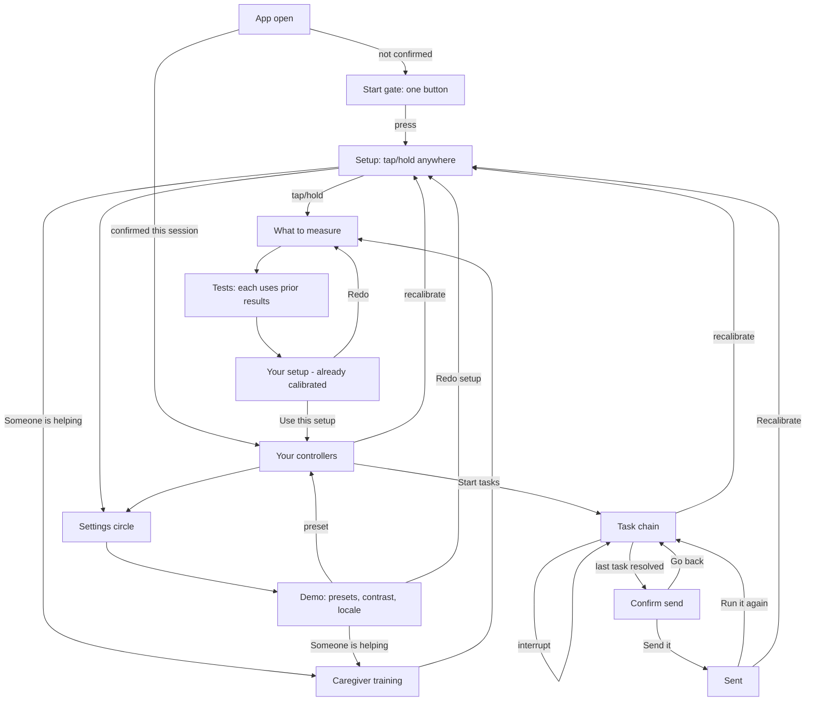

# Phone app UI/UX wireframe spec

Low-fi wireframe in text: every screen, what is essential vs supporting, and the only legal order. Documents what is already built in `code/app` plus the intended flow. Not a pixel mock. Not a visual redesign.

**Amended 2026-09-06** per [idea/30 — Meeting Notes: Onboarding & Calibration Walkthrough](../idea/30-meeting-notes-onboarding-calibration-walkthrough.md): adds the Start gate screen (§3, §4.0a), reorders/rescopes the Hold step (§4.5), flips axis-picker defaults to all-on with a long-press skip (§4.3), and moves high-contrast/language/helper controls out of the primary reach zone on Setup (§4.1). Not yet implemented in `code/app` — this file is the target state.

**Code:** `code/app/lib/main.dart` (screens), `calibration/`, `runtime/`, `training/`, `vision/`.  
**Requirements:** [idea/08-requirements.md](../idea/08-requirements.md).  
**Scope:** [idea/05-scope.md](../idea/05-scope.md).  
**Voice/text modes:** [desgin.md](desgin.md).

---

## 1. Purpose

| Who | What they do |
|---|---|
| **Person being measured** | Tap/hold to start, run (or skip) tests, use the resulting controllers on a short task chain |
| **Optional helper** | Same phone; practice motions first, then pick which axes to measure |
| **Judge / demo** | Skip live calibration via Profile A / B / Floor presets; same runtime object |

**Done** means: a `CapabilityProfile` exists, then at least one consequential intent is confirmed and “sent” (logged to the output strip — no real laptop wire in this build).

---

## 2. Global rules

These apply once measurement has started (live draft) and after a confirmed profile (preview + demo).

| Rule | Detail |
|---|---|
| **Output strip** | Laptop preview: last intent + live raw signal. Sits on the row the user cannot reach (`outputAtBottom`). Tap opens the event log. |
| **Visual field shell** | Tunnel or peripheral veil; mask uses `IgnorePointer`. Stays **full** until vision commits; then applies including on the results report. |
| **Theme** | Haiku after axes/profile; **high contrast** is a peer palette (WCAG 4.5:1 text / 3:1 chrome), not a haiku variant. |
| **Scale / targets** | Text scale from vision; min target size from buttons — applied to Skip and later chrome **as soon as measured**. |
| **Input dock** | Joystick floats at stick home / reach anchor; everything else docks inside the reachable zone. |
| **Live draft** | After each test, `draft.build()` is pushed into `AppState` so the next step is already shaped. |
| **Recalibrate / Redo** | Settings, results, or preview tune → **Setup** (clears confirmation). Never back to a blended demo home. |

**Calibration step chrome** (shared `StepFrame`):

- One short instruction line, always in the same place.
- Progress `N of M`.
- **Skip this test** always present; height follows measured `minTargetSize`.
- Skip = **untested**, never failed.

---

## 3. Locked end-to-end flow

Do not reorder these edges.



### Flow notes

- **Start gate is the true launch screen, Setup is second.** A single low-effort button, nothing else — no header, no recorded audio, no secondary controls. Its only job is to be the user gesture that authorizes the recorded welcome to autoplay on the next screen (Setup), and to give the flow exactly one obvious first action instead of several things at once. Every cold open goes through it; recalibrate/redo from elsewhere in the app returns to **Setup** directly, not back through Start (the app is already "open" at that point).
- **Setup is the second screen** — “Set up how you control things” / tap anywhere. Demo presets live behind the **settings circle** (top-right), not on the first or second screen.
- **Presets skip measurement on purpose** (judge demo, scope item 3). Live calibration and a preset both produce the same `CapabilityProfile`.
- **Assisted:** training → axes (not training → entry). Helper button stays on Setup at the same time as tap-anywhere.
- **After each motor/voice/vision step**, the partial profile is live-applied before the next step.
- **Results already use** measured size, scale, and field. “Use this setup” confirms for the session; it does not start applying the profile.
- In-session only: killing the app returns to Setup.

---

## 4. Screen inventory

Each screen: ASCII wireframe → essential → supporting → functions.

### 4.0a Start gate (first screen, new)

```
┌─────────────────────────────────────┐
│                                       │
│                                       │
│         ┌ PRESS TO BEGIN ┐           │
│                                       │
│                                       │
└─────────────────────────────────────┘
```

| Essential | Supporting |
|---|---|
| One full-block tap/hold target, nothing else on screen | — (deliberately none) |

**Functions:** the single user gesture that authorizes the Setup screen's recorded welcome to autoplay, and gives the whole app one unambiguous first action. No header text, no toggles, no recorded audio here — those all belong to Setup, one screen later. Never shown again once a session has started (recalibrate/redo return to Setup, not here).

### 4.1 Setup (second screen)

```
┌─────────────────────────────────────┐
│                              (settings) │  ← circle, 48dp, upper corner —
│                                       │     reachable via that interface,
│  ┌ TAP ANYWHERE TO START ┐          │     not required to be in the
│  Recorded welcome — autoplays        │     primary reach zone
│                                       │
├─────────────────────────────────────┤
│ [ Someone is helping set this up ]  │  ← upper area, out of primary
│ [ High contrast ] [ Language ]       │  ← reach zone (both correct by
│                                       │  default; helper is caregiver-
│                                       │  operated) — see rule below
├─────────────────────────────────────┤
│  (bottom / thumb-reach zone: the     │
│   tap-anywhere block ONLY)           │
└─────────────────────────────────────┘
```

**Reach-zone rule (per idea/30 Decisions §4):** the bottom/thumb-reachable region of this screen is reserved *exclusively* for the primary tap-to-start action. High contrast, language, and "someone is helping" all sit outside that zone (upper area) — high contrast and language don't need to be within the target user's easy reach because they're correct by default and don't require interaction; "someone is helping" doesn't need to be there either since a caregiver, not the target user, is the one who acts on it. All three remain reachable via some control on screen, just not competing with the primary action's zone.

The recorded welcome **autoplays** once this screen mounts (the Start-gate tap satisfies any platform audio-gesture requirement) — no separate "Play recording" tap is needed on the primary path; the existing play/replay control (§6) stays available as a secondary affordance for a second listen, not as the only way to trigger it.

High contrast defaults **ON** (opt-out). Language defaults to `en` regardless of device locale — it only changes which recorded-narration clip plays (welcome/training), not any other on-screen text, so a device-locale default would overstate what it does.

| Essential | Supporting |
|---|---|
| Full-block tap/hold → axis picker | Recorded welcome (now autoplays) |
| Helper outlined button, same time as tap block, positioned outside the reach zone | Settings circle → demo sheet |

**Functions:** start solo measurement; start assisted training; open settings for demo presets.

### 4.1b Settings sheet (demo / judge)

**Amended:** high contrast and locale chips live on **Setup itself** (§4.1, outside the primary reach zone), not here — they're accessibility defaults every user gets, not demo-only options. Only the genuinely demo/judge-only affordance (saved-profile presets, which skip live measurement) lives behind this sheet.

| Essential | Supporting |
|---|---|
| OR START FROM A SAVED PROFILE (A / B / Floor) | |
| Redo setup (when a profile is confirmed) | |
| Someone is helping set this up | |

Presets jump straight to preview. Redo clears confirmation and remounts Setup.

### 4.2 Caregiver training

Reached only via “Someone is helping…”. No scores. Practice before measurement.

```
┌─────────────────────────────────────┐
│ Practice with a helper              │
│ (no score copy)                     │
│ ┌─ Recorded training clip ────────┐ │
│ └─────────────────────────────────┘ │
│ Motion 1 of 3 · Together            │
│ Instruction: Tap the square.        │
│ Helper: Hand under theirs…          │
│ ┌─────────────────────────────────┐ │
│ │           ARENA / TAP           │ │
│ └─────────────────────────────────┘ │
│ [ Try again ]                       │
│ [ Skip this motion ]                │
├─────────────────────────────────────┤
│ [ Skip all practice, go to measure ]│  ← pinned footer
└─────────────────────────────────────┘
```

| Essential | Supporting |
|---|---|
| One motion at a time: tap → slide left → slide up | Recorded training narration |
| Phase label: together / start-together-finish-alone / from the words alone | Independent hit counter when in independent phase |
| Helper copy: hand-under-hand default | |
| Arena (only practice target) | |
| Try again, skip this motion | |
| **Skip all practice, go to measurement** — pinned, always visible | |

**Functions:** fade prompt full → partial → independent (3 independent successes graduate a drill); skip motion; skip all → axis picker (`helperChoseAxes = true`).

---

### 4.3 Axis picker — “What should we measure?”

```
┌─────────────────────────────────────┐
│ What should we measure?             │
│ (optional) Setting this up for…     │  ← only if helperChoseAxes
│ WHICH ENVIRONMENTS (all on by default)│
│ ┌ Motor ………………… ☑ (hold to skip) ┐ │
│ ┌ Speech …………… ☑ (hold to skip) ┐ │
│ ┌ Vision …………… ☑ (hold to skip) ┐ │
│ [ Start ]                           │
└─────────────────────────────────────┘
```

**Defaults (per idea/30 Decisions §3):** Motor, Speech, and Vision all start **ON** — a user who does nothing and presses Start gets the full test, not an empty one. Turning an axis **off** is a large, low-effort, long-press/hold-to-confirm action on that row (mirroring the app's existing hold-to-confirm pattern from the Hold step), not a precise tap — so someone with exactly the motor difficulty this screen exists to measure isn't blocked by the row's own control. "Start" no longer needs a disabled state for "nothing selected," since something is always selected by default.

| Essential | Supporting |
|---|---|
| Motor / Speech / Vision as **large whole-row toggles**, all on by default | Helper provenance banner |
| Long-press/hold-to-confirm to turn an axis off | Haiku theme begins reacting live as toggles change |
| Start → gated step list | |

**Functions:** set `measureMotor` / `measureSpeech` / `measureVision`. Axes turned off contribute **no** steps (speech-only never mounts joystick).

---

### 4.5 Measurement steps

Only steps for axes left on. **Order when all on (amended per idea/30 Decisions §2): reach → buttons → hold → joystick → trackpad → voice → vision.** Hold moves up from last-among-motor to right after Buttons, and changes scope: it no longer runs once against an arbitrary target — it runs **once per button/cell that the Buttons step already found tappable**, so the app learns which subset of those buttons is also holdable (e.g. 5 tappable, 2 of them also holdable → 7 distinct usable inputs, not one undifferentiated capability). Calibration time for this step now scales with however many buttons Buttons found, not a fixed single attempt.

| Step | Person does | Essential UI |
|---|---|---|
| **Reach** | Tap cells that work | 3×4 grid, skip |
| **Buttons** | Hit large targets | Targets at measured size, skip |
| **Hold** | Press and hold, once per button Buttons found tappable | Hold target per button, skip |
| **Joystick** | Swing per reachable cell | Stick + home-cell result, skip |
| **Trackpad** | Drag; axis lock if needed | Pad, skip |
| **Voice** | Say 8 sentences | Current sentence, word kept, “That word was clear” / “Not this one”, hold-to-speak, next sentence |
| **Vision** | Read shrinking word, then field | Acuity choice → full / tunnel / peripheral |

| Essential on every step | Supporting |
|---|---|
| Instruction + progress + Skip | Idle timeout may skip a stuck step; toast explains |
| Skip = untested | Simulated speech clarity chips on Voice |

**Voice buckets** after sentences: ≥6 words landed → `full`; some → `partial` + vocabulary; sounds heard → `sounds`; else `none`.

---

### 4.6 Results — “Your setup”

Four sections (tabs / section nav), not one endless scroll.

```
┌─────────────────────────────────────┐
│ Your setup                          │
│ [Overview][Methods][Voice][Tasks]   │
│ …section body…                      │
├─────────────────────────────────────┤
│ [ Redo ]           [ Use this setup ]│
└─────────────────────────────────────┘
```

| Section | Essential content |
|---|---|
| **Overview** | Measured environments; helper provenance if any; haiku card |
| **Methods** | Per-method scores; reach count; stick home; target size; steadiness; hold; voice; vision + field; input level; personal words if any |
| **Voice & text** | Dictate / vocal-confirm / touch-pick plan; skipped list; swipe axis lock if set |
| **Tasks** | For each task shape: which method, ideal vs fallback reason |

| Footer essential | Supporting |
|---|---|
| **Redo** → axis picker | Haiku motif (identity, not a control) |
| **Use this setup** → preview | |

---

### 4.7 Preview — “Your controllers”

```
┌─────────────────────────────────────┐
│ ▓▓▓ OUTPUT STRIP (laptop preview) ▓▓▓│
│ Your controllers          [tune]    │
│ [Buttons][Joystick·yours][…][Voice] │
│ Hint for current surface            │
│ ┌──── try pad / dock ─────────────┐ │
│ └─────────────────────────────────┘ │
│ [Simpler] Level: … [Level up]       │
│ [ Start tasks ]                     │
└─────────────────────────────────────┘
```

| Essential | Supporting |
|---|---|
| Output strip pinned | Level label copy |
| Surface chips: Buttons, Joystick, Trackpad, Switch, Voice (strongest marked “yours”) | |
| Try pad using this profile’s size / reach / voice mode | |
| **Simpler / Level up** (one → two → many targets) | |
| **Start tasks** | |
| Recalibrate (tune) → home | |

---

### 4.8 Demo task chain

Fixed order. Every task screen shares:

```
┌─────────────────────────────────────┐
│ ▓▓▓ OUTPUT STRIP ▓▓▓                │  (top or bottom by reach)
│ Ribbon: prompt + why this method    │
│ [recalibrate] [controllers]         │
│ ┌──── task body / dock ───────────┐ │
│ └─────────────────────────────────┘ │
│ [ Stop / start this step over ]     │
└─────────────────────────────────────┘
```

| # | Task | Shape | Essential behavior |
|---|---|---|---|
| 1 | Pick a plan | Discrete | Options paged by `visibleOptionCount`; method from fallback rule |
| 2 | Set seat count | Continuous | Adjust + confirm with chosen method |
| 3 | Mark a spot | Pointing | Place marker; agent-assist only when not trackpad |
| 4 | Add a note | Text (fusion) | See Thesis B below |
| 5 | Review | Discrete | “About to send…” + **Send it** / **Go back** via **same** method |
| 6 | Sent | Done | Run it again / Recalibrate |

**Interrupt:** resets **current step** state only (not the whole profile / collected answers).

#### Text task — Thesis B (essential)

| Clarity | How content is filled |
|---|---|
| `full` / `partial` | Hold to speak → transcript → confirm (partial always confirms) |
| `sounds` | One sound / nod / hum = yes; two sounds = next phrase |
| `none` | Pick a suggested phrase by touch method |

**Vocabulary** (when `usesWordVocab`): small menus map words onto options; long menus map first three words to next / previous / select (e.g. `water` / `tank` / `yellow`).

---

## 5. How the same screen changes

| Lever | What changes |
|---|---|
| **Profile A** | Precise touch, clear speech → buttons-heavy, dictate, full field, many targets |
| **Profile B** | Imprecise touch + partial speech → often joystick fallback, vocab words, two targets |
| **Floor** | Switch scan, sounds tier, tunnel field, one target |
| **Input level** | How many discrete options visible at once (one / two / many capped by `maxControls`) |
| **Visual field** | Tunnel: condensed output window; peripheral: center veiled; both leave hits through |
| **High contrast** | Black / white / yellow peer theme |
| **Locale** | Recorded onboarding catalog `en` / `ml` |
| **Fallback rule** | Ideal method for the task shape unless another scores ≥ margin higher |

---

## 6. Supporting (never block the path)

- Event log sheet (from output strip).
- Replay-recording button on Setup (timed transcript + screen-reader announcement until WAVs exist) — secondary now that the welcome autoplays on arrival; still there for a second listen.
- Toast on skip / idle.
- Level-up / Simpler chrome on preview.
- Haiku motif on results.

---

## 7. Hard constraints (non-negotiable)

| Constraint | Why / FR |
|---|---|
| First action never harder than a single tap/hold anywhere | Issue #1; entry must not gate on precision |
| Helper path visible at the same time, not a second screen to discover | Research 11 |
| Every calibration step skippable | FR13–15 honesty; untested ≠ fail |
| No consequential send without explicit confirm | FR7 |
| Interrupt resets current step, not whole profile | FR8 |
| Skip / untested ≠ fail | Results / scoring honesty |
| Field mask never steals hits | Issue #4 |
| High contrast peer to haiku (4.5:1 / 3:1) | Research 11 |
| Profile switch visibly reshapes the interface | Scope item 3; FR11 |
| Touch + voice fused at least once on partial profile | Scope item 4; FR4 |

---

## 8. Out of scope for this phone wireframe

- Desktop ranking / inspector.
- Aperture Daily mock websites.
- Real microphone / WAV assets (catalog stands in).
- Agent filling a real form / laptop wire.
- Camera head-nod as a separate sensor.

Those are other surfaces or future work; this spec stays on the Flutter phone flow only.
